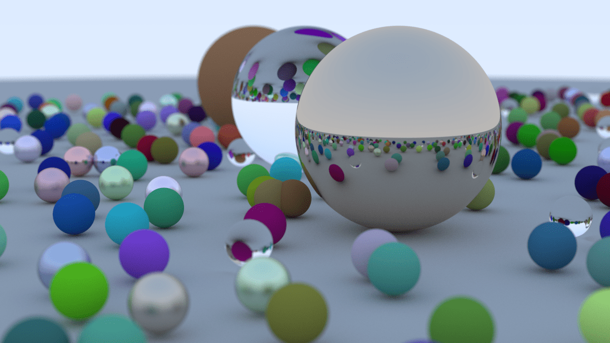

# rtow_rust
This is my attempt in following the Ray Tracing in One Weekend tutorial while learning Rust at the same time.
It was pretty fun. Path tracing is way more intuitive than rasterization, which made it easier to distinguish between
my errors in understanding the path tracing algorithms and my errors with Rust paradigms.

I do have some inefficiencies regarding Rust's cloning system, especially in the camera implementation.
The camera attributes which are meant to be initialized after instantiation are left as Option<T>, 
which means any attempt to access them results in unnecessary cloning for whichever T's are not primitives.

Probably there are other inefficiencies which I just don't realize. This is admittedly my first experience with Rust.

